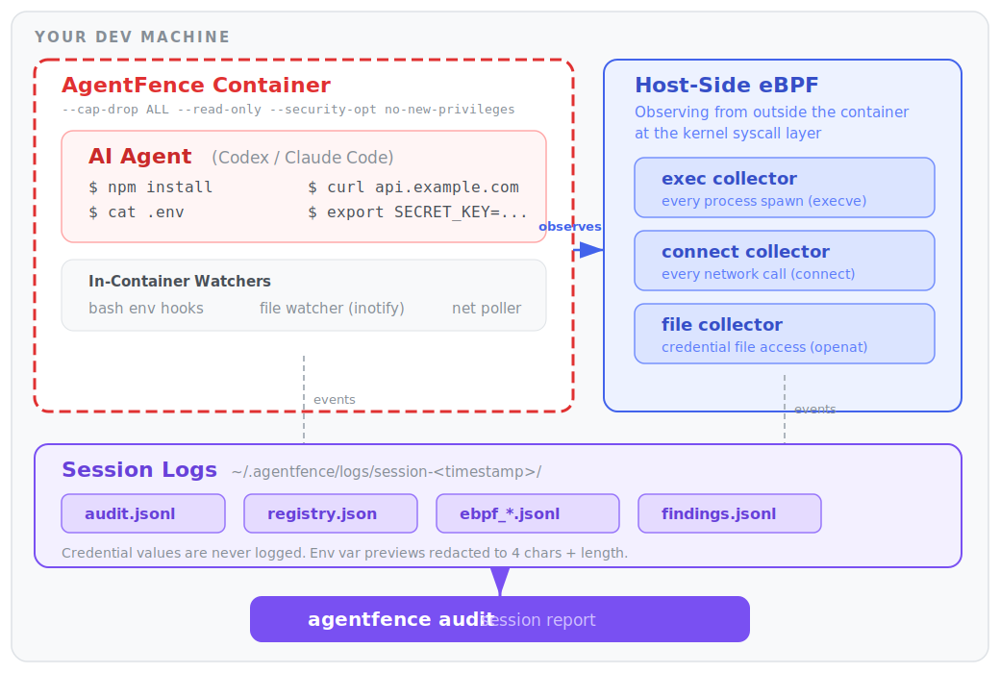
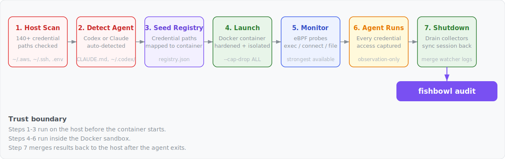
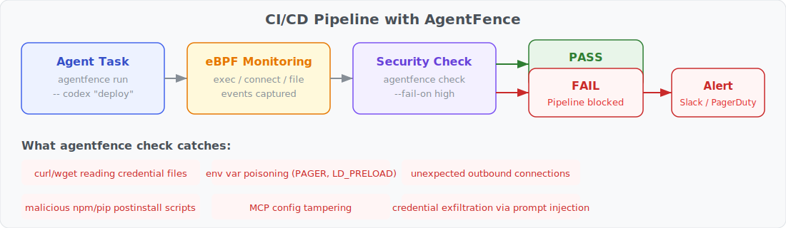

# Fishbowl

[](https://github.com/Antonlovesdnb/fishbowl/releases)
[](https://github.com/Antonlovesdnb/fishbowl/actions)
[](https://www.rust-lang.org/)
[]()
[](LICENSE)
[](AGENTS.md)

<picture>
  <source media="(prefers-color-scheme: dark)" srcset="docs/architecture-dark.svg">
  <source media="(prefers-color-scheme: light)" srcset="docs/architecture-light.svg">
  
</picture>

A containerized credential auditing perimeter for AI coding agents. Validated end-to-end with **Codex** and **Claude Code** on both macOS and Linux.

Fishbowl wraps your AI agent in a Docker container, audits every credential access, environment variable mutation, and outbound network connection, then gives you a session report. It's observation-only — it doesn't block or kill anything the agent does.

The container is the security boundary. The agent can see your project directory, its own auth files (auto-mounted copies of `~/.codex/` or `~/.claude/`), any credentials you explicitly `--mount`, and the session logs — but not the rest of your home directory or system. The container filesystem is read-only, all Linux capabilities are dropped, and privilege escalation is disabled.

## How it works

<picture>
  <source media="(prefers-color-scheme: dark)" srcset="docs/flow-dark.svg">
  <source media="(prefers-color-scheme: light)" srcset="docs/flow-light.svg">
  
</picture>

When you run `fishbowl run ~/my-project`, this is what happens:

1. **Host credential scan.** Fishbowl walks your home directory and project for known credential files (`.env`, `~/.aws/credentials`, `~/.codex/auth.json`, SSH keys, etc.) and prints what it finds. The scan report is saved to a host-only location (`~/.fishbowl/host-scans/`) — it is NOT visible inside the container. See [docs/credential-scanning.md](docs/credential-scanning.md) for the full list of paths and classification rules.

2. **Agent auto-detection.** Based on project markers (`CLAUDE.md`, `AGENTS.md`), host auth artifacts (`~/.codex/`, `~/.claude/`), and environment variable references, Fishbowl picks the agent type and auto-mounts the relevant auth files into `/fishbowl/home/` inside the container. See [docs/agent-detection.md](docs/agent-detection.md) for the detection priority cascade and what each agent gets. **Credential env vars and SSH keys referenced in project text are NOT auto-passed** — Fishbowl prints them as recommendations but requires explicit `--mount` to avoid a malicious repo silently importing host secrets.

3. **Registry seeding.** Credential paths from the host scan are translated to their in-container equivalents and written to the runtime credential registry (`registry.json`). This is how the file collector knows which `openat()` events are interesting.

4. **Container launch.** Docker runs the agent inside a hardened container:
   - `--cap-drop ALL --security-opt no-new-privileges`
   - Project bind-mounted at `/<project-name>` and `/workspace`
   - Selected credentials at `/fishbowl/creds/` and `/fishbowl/ssh/` (read-only)
   - Agent auth at `/fishbowl/home/` (the container's `$HOME`)
   - Session logs at `/var/log/fishbowl/`

5. **Monitoring starts.** Fishbowl picks the strongest monitoring available:
   - **Linux:** host-side bpftrace via a `sudo` helper, scoped to the container's cgroup
   - **macOS:** bpftrace in a privileged sidecar container inside the Docker VM (auto-detects Docker Desktop, Colima, OrbStack, Rancher Desktop)
   - **Fallback:** if the strong path fails (no root, Docker not running, collector image missing), prints the reason and continues with container-local telemetry (bash env hooks, inotify file watchers, `ss` network polling)

6. **Agent runs.** Your agent does its work inside the container. Every `execve()`, `connect()`, and `openat()` on a monitored credential is captured.

7. **Shutdown.** When the agent exits, Fishbowl gracefully drains the bpftrace collectors (SIGINT + 1.5s grace period) and tears down the helper container. Session state is synced back to the host for Codex/Claude.

## Install

```bash
curl -fsSL https://raw.githubusercontent.com/Antonlovesdnb/fishbowl/main/install.sh | sh
```

That's it. The script auto-detects your OS and architecture, downloads the right binary and the collector image from the latest [GitHub release](https://github.com/Antonlovesdnb/fishbowl/releases), verifies the SHA256 checksum, and installs to `/usr/local/bin` (or `~/.local/bin` if no write access).

**Supported platforms:** macOS (Apple Silicon) and Linux (x86_64 + arm64). Linux binaries are fully static (musl libc) so they run on any distro including Alpine.

**Requirements:** a container runtime — Docker Desktop, Colima, OrbStack, or Rancher Desktop — must be running before `fishbowl run`.

**Options:** pin a version with `FISHBOWL_VERSION=v0.1.9`, override the install directory with `FISHBOWL_BIN_DIR=...`.

**That's the whole install.** The container image gets built automatically the first time you run `fishbowl run` (a few minutes; one-time). If you'd rather get that out of the way up front, run `fishbowl build-image` after installing.

> **Building from source:** `cargo install --path .` (requires Rust >= 1.85). Only needed if you're contributing or want to modify the container image. The first `fishbowl run` will build the container image automatically, same as the prebuilt-binary path.

### Uninstall

```bash
curl -fsSL https://raw.githubusercontent.com/Antonlovesdnb/fishbowl/main/install.sh | sh -s -- --uninstall
```

Removes the binary, Docker images, and optionally `~/.fishbowl/` (prompts before deleting session data).

## Usage

```bash
# Run the current directory
fishbowl run

# Run a specific project
fishbowl run ~/projects/my-app

# Mount a credential (auto-detects type: env var, SSH key, or credential file)
fishbowl run --mount GH_TOKEN --mount ~/.ssh/id_ed25519 --mount ~/secrets/service.json

# Use host networking (for VPN/lab routes)
fishbowl run --network host
```

Mounted credentials appear inside the container at `/fishbowl/creds/<filename>` (credential files) and `/fishbowl/ssh/<filename>` (SSH keys). Environment variables are passed through directly.

## Reviewing sessions

After a run, review what happened:

```bash
fishbowl audit              # most recent session
fishbowl audit <SESSION>    # specific session directory
```

The audit report shows:
- **Credentials** — each discovered credential, its classification, access count, and expected destinations
- **Alerts** — medium/high/critical severity events (env mutations, credential access by suspicious processes)
- **Network** — outbound destinations with connection counts and alert flags

### Session log location

All session data lives under `~/.fishbowl/logs/`:

```
~/.fishbowl/
  logs/
    latest -> session-1775780487       # symlink to most recent
    session-1775780487/                # one directory per run
      audit.jsonl                      # all audit events (JSONL)
      registry.json                    # credential registry (live state)
      findings.jsonl                   # credential-egress correlation findings
      ebpf_exec.jsonl                  # host eBPF: process exec events
      ebpf_connect.jsonl               # host eBPF: network connect events
      ebpf_file.jsonl                  # host eBPF: credential file access events
      ebpf_scope.json                  # eBPF container scope metadata
      ebpf_*.stderr.log                # bpftrace stderr (empty = probes attached OK)
  host-scans/
    session-1775780487.json            # host credential path enumeration (host-only)
  runtime/
    session-1775780487-<nonce>/        # runtime auth copies (cleaned up after 6h)
```

### Log formats

**audit.jsonl** — one JSON object per line, every event from both in-container watchers and host eBPF collectors:

```json
{
  "timestamp": "2026-04-10T00:21:29+00:00",
  "event": "process_exec",
  "severity": "info",
  "agent": "host-ebpf",
  "command": "/bin/cat",
  "path": "/usr/bin/cat",
  "process_name": "cat",
  "observed_pid": "40643",
  "process_chain": "cat(pid=40643) <- bash(pid=40626) <- tini <- containerd-shim <- systemd",
  "env_findings": [{"variable": "BASH_ENV", "value_preview": "/age...(redacted,len=23)"}],
  "discovery_method": "host_ebpf_exec",
  "verdict": "observed"
}
```

Event types: `process_exec`, `env_mutation`, `env_enumeration`, `credential_discovery`, `credential_access`, `network_egress`, `workspace_credential_access`.

Full credential values are **not intentionally logged**. Environment variable findings include a short preview (first 4 characters + length) for classification purposes — e.g. `sk-p...(redacted,len=48)`. Credential env vars are passed to Docker via `--env-file` (not CLI args) to avoid exposure in the host process table.

**registry.json** — live credential registry, updated as credentials are discovered and accessed:

```json
{
  "credentials": [
    {
      "id": "file::/fishbowl-smoke/.env",
      "classification": "Project .env Credential File",
      "discovery_method": "project_scan",
      "path": "/fishbowl-smoke/.env",
      "access_count": 3,
      "last_accessed_at": "2026-04-10T00:21:29+00:00"
    }
  ]
}
```

**ebpf_file.jsonl** — credential access events from the kernel file collector:

```json
{
  "event": "credential_access",
  "process_name": "cat",
  "raw_path": "/workspace/.env",
  "resolved_path": "/fishbowl-demo/.env",
  "operation": "openat",
  "classification": "Project .env Credential File",
  "process_chain": "cat <- bash <- tini <- containerd-shim <- systemd",
  "collector": "bpftrace_file"
}
```

**ebpf_exec.jsonl** — every process spawn inside the container:

```json
{
  "event": "process_exec",
  "process_name": "bash",
  "filename": "/usr/bin/curl",
  "cmdline": "curl -sS https://example.com/",
  "process_chain": "curl <- bash <- tini <- containerd-shim <- systemd",
  "env_findings": [
    {
      "variable": "BASH_ENV",
      "classification": "Dangerous Execution Environment Variable",
      "value_preview": "/age...(redacted,len=23)"
    }
  ],
  "collector": "bpftrace_exec"
}
```

**audit.jsonl** — env mutations caught by the bash hooks:

```json
{
  "event": "dangerous_env_mutation",
  "severity": "medium",
  "command": "export PAGER=\"evil-pager\"",
  "variable": "PAGER",
  "new_value": "\"evi...(redacted,len=12)",
  "reason": "dangerous variable mutation command observed"
}
```

**findings.jsonl** — credential-access-then-network-connect correlation findings (e.g., "process read ~/.codex/auth.json then connected to 185.x.x.x:443").

## Platform support

| Platform | Monitoring | Notes |
|---|---|---|
| **Linux** (source or binary) | Host-side eBPF via `sudo` helper | Full exec/connect/file coverage, cgroup-scoped. No collector image needed — bpftrace runs as the host binary. |
| **macOS** (source install) | eBPF sidecar in Docker VM | Same coverage. `fishbowl build-image` builds both the agent and collector images. Auto-detects Docker Desktop/Colima/OrbStack/Rancher. |
| **macOS** (prebuilt binary) | Container-local watchers | The collector image requires the source tree to build. `install.sh` attempts to download a pre-built collector from the release, but this requires repo access. Falls back to container-local telemetry if unavailable. |
| **Any host, fallback** | Container-local watchers | If the eBPF path fails (no root on Linux, Docker not running, etc.), Fishbowl falls back to bash env hooks, inotify file watchers, and `ss` network polling. |

**Container images are platform-specific.** After cloning to a different architecture, run `fishbowl build-image` before `fishbowl run`.

## Known limitations

- **In-container audit log is writable by the agent.** The in-container watchers write `audit.jsonl` and `registry.json` to a writable subdirectory (`/var/log/fishbowl/watcher/`) inside the container. A compromised agent could tamper with this watcher output. However, the **host-side eBPF logs (`ebpf_*.jsonl`) are protected** — the parent session logs directory is mounted read-only into the agent container, and the eBPF logs are written by the helper container via its own mount. So the high-fidelity event data (exec, connect, file access from the kernel layer) is tamper-proof; only the in-container watcher events are at risk.

- **Fallback monitoring has coverage gaps.** When strong monitoring (the default) is unavailable — no root on Linux, or collector image missing on macOS — Fishbowl falls back to container-local watchers. These have known gaps: bash env hooks don't fire for `sh`/`python`/`node`, the `ss` network poller misses sub-50ms connections, and UDP/DNS isn't covered. Strong monitoring covers all of these via kernel-level eBPF probes.

- **Tested agents.** Only Codex and Claude Code have been validated end-to-end. Cursor, Windsurf, and Copilot have scaffolded enum variants in the code but the wrapped-session flow hasn't been exercised for them.

## Security model

<picture>
  <source media="(prefers-color-scheme: dark)" srcset="docs/trust-boundary-dark.svg">
  <source media="(prefers-color-scheme: light)" srcset="docs/trust-boundary-light.svg">
  

</picture>

Fishbowl provides **visibility into opportunistic credential exfiltration** — malicious npm/pip postinstall scripts, env-var poisoning (CVE-2026-22708), MCP config tampering via prompt injection (CVE-2025-54135/54136), and prompt injection that runs `curl`/`wget` to exfiltrate credentials.

**Out of scope:** determined adversaries who specifically target the monitoring stack, the agent encoding credentials into its own API channel (e.g. to `api.anthropic.com`), and sophisticated multi-step exfil chains.

Fishbowl is **observation-only at runtime.** It does not block, terminate, or interfere with the agent. For kernel-level prevention with enforcement, see [owLSM](https://github.com/Cybereason-Public/owLSM), [Falco](https://falco.org/), or [Tetragon](https://tetragon.io/) — Fishbowl is complementary to these tools, not a replacement for them.

## CI/CD integration

<picture>
  <source media="(prefers-color-scheme: dark)" srcset="docs/ci-pipeline-dark.svg">
  <source media="(prefers-color-scheme: light)" srcset="docs/ci-pipeline-light.svg">
  
</picture>

Use `fishbowl check` to gate CI/CD pipelines on session security. It reads the session logs, counts events by severity, and exits non-zero if the threshold is exceeded.

```bash
# Run the agent task inside Fishbowl
fishbowl run ~/my-app --mount API_KEY -- codex "run the deploy script"

# Gate the pipeline — fail if any high-severity events occurred
fishbowl check --fail-on high
```

Severity levels: `low`, `medium`, `high`, `critical`. The default threshold is `high`.

```
Fishbowl Check
Session:  /Users/dev/.fishbowl/logs/session-1775954089
Threshold: --fail-on high

Events:   12 total (2 info, 0 low, 9 medium, 1 high, 0 critical)
eBPF:     9 exec, 2 file, 1 connect

Result:   FAIL (1 events at or above high severity)

  HIGH      credential_access_by_network_tool: curl accessed credential file /workspace/.env
```

What it catches:
- **Credential exfiltration** — `curl`/`wget`/`python` reading credential files
- **Env var poisoning** — `PAGER`, `LD_PRELOAD`, `GIT_ASKPASS` mutations
- **Supply chain attacks** — malicious postinstall scripts accessing secrets
- **MCP config tampering** — unauthorized server additions during agent sessions
- **Prompt injection** — agent tricked into running exfiltration commands

In a GitHub Actions workflow:

```yaml
- name: Deploy with Fishbowl
  run: |
    fishbowl run . --mount DEPLOY_KEY -- codex "deploy to staging"
    fishbowl check --fail-on high
```

If `fishbowl check` exits non-zero, the pipeline stops and the full session audit log is available for investigation.
