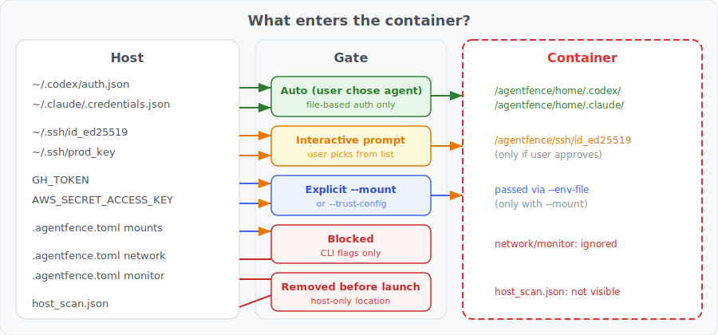

# Credential Scanning

Fishbowl scans for credentials in two passes before the container starts. The results seed the runtime credential registry so the file collector knows which `openat()` events are interesting.

## Host scan (`source: "host_scan"`)

Walks well-known credential locations under `~/`. Only checks if files exist — never reads their contents.

### SSH keys

All files under `~/.ssh/` are checked. A file is classified as an SSH private key if:
- Its name starts with `id_` (and doesn't end with `.pub`), OR
- It contains a PEM header (`-----BEGIN ... PRIVATE KEY-----`), OR
- It has a `.pem`/`.key` extension and contains `PRIVATE KEY`

Excluded: `known_hosts`, `config`, `authorized_keys`, `*.pub`.

### Git credential stores

| Path | Classification |
|---|---|
| `~/.git-credentials` | Git Credential Store |
| `~/.config/git/credentials` | Git Credential Store (XDG) |
| `~/.gitconfig` | Git Global Config |

### AI / ML services

| Path | Classification |
|---|---|
| `~/.claude/.credentials.json` | Claude OAuth Credentials |
| `~/.claude.json` | Claude Local Config |
| `~/.codex/auth.json` | Codex Auth Store |
| `~/.codex/config.toml` | Codex Local Config |
| `~/.config/github-copilot/hosts.json` | GitHub Copilot Auth |
| `~/.config/github-copilot/apps.json` | GitHub Copilot Apps |
| `~/.cache/huggingface/token` | HuggingFace Token |
| `~/.huggingface/token` | HuggingFace Token |
| `~/.config/replicate/auth` | Replicate Auth |
| `~/.config/cohere/config` | Cohere CLI Config |
| `~/.cursor/mcp.json` | Cursor MCP Config |

### Cloud providers

| Path | Classification |
|---|---|
| `~/.aws/credentials` | AWS Credentials File |
| `~/.aws/config` | AWS Config File |
| `~/.config/gcloud/application_default_credentials.json` | GCP Application Default Credentials |
| `~/.config/gcloud/access_tokens.db` | GCP Access Token Cache |
| `~/.config/gcloud/credentials.db` | GCP Credentials Database |
| `~/.config/gcloud/properties` | GCP Properties Config |
| `~/.boto` | GCS Boto Config |
| `~/.config/gcloud/legacy_credentials/*.[json\|db]` | GCP Legacy Credential Artifact |
| `~/.azure/*.[json\|pem\|key\|bin]` | Azure Credential Artifact |
| `~/.config/doctl/config.yaml` | DigitalOcean CLI Config |
| `~/.config/linode-cli` | Linode CLI Config |
| `~/.vultr-cli.yaml` | Vultr CLI Config |
| `~/.config/hcloud/cli.toml` | Hetzner Cloud CLI Config |
| `~/.oci/config` | Oracle Cloud CLI Config |
| `~/.bluemix/config.json` | IBM Cloud CLI Config |
| `~/.bluemix/.cf/config.json` | IBM Cloud CF Config |
| `~/.wrangler/config/default.toml` | Cloudflare Wrangler Config |
| `~/.config/.wrangler/config/default.toml` | Cloudflare Wrangler Config |
| `~/.config/vercel/auth.json` | Vercel CLI Auth |
| `~/.local/share/com.vercel.cli/auth.json` | Vercel CLI Auth |
| `~/.netlify/config.json` | Netlify CLI Config |
| `~/.config/netlify/config.json` | Netlify CLI Config |
| `~/.fly/config.yml` | Fly.io CLI Config |
| `~/.railway/config.json` | Railway CLI Config |
| `~/.render/config.yaml` | Render CLI Config |
| `~/.config/heroku/config.json` | Heroku CLI Config |
| `~/.config/scw/config.yaml` | Scaleway CLI Config |
| `~/.aliyun/config.json` | Alibaba Cloud CLI Config |
| `~/.tccli/default.credential` | Tencent Cloud CLI Credentials |
| `~/.config/openstack/clouds.yaml` | OpenStack Clouds Config |
| `~/.config/openstack/secure.yaml` | OpenStack Secure Config |

### HashiCorp

| Path | Classification |
|---|---|
| `~/.vault-token` | HashiCorp Vault Token |
| `~/.consul-token` | HashiCorp Consul Token |
| `~/.nomad-token` | HashiCorp Nomad Token |
| `~/.terraformrc` | Terraform CLI Config |
| `~/.terraform.d/credentials.tfrc.json` | Terraform Cloud Credentials |
| `~/.pulumi/credentials.json` | Pulumi Credentials |

### Package managers

| Path | Classification |
|---|---|
| `~/.npmrc` | NPM Token Config |
| `~/.yarnrc` | Yarn Token Config |
| `~/.yarnrc.yml` | Yarn 2+ Token Config |
| `~/.config/pnpm/rc` | pnpm Config |
| `~/.pypirc` | Python Package Index Credential File |
| `~/.pip/pip.conf` | Pip Config |
| `~/.config/pip/pip.conf` | Pip Config (XDG) |
| `~/.gem/credentials` | RubyGems Credentials |
| `~/.bundle/config` | Bundler Config |
| `~/.cargo/credentials.toml` | Cargo Registry Token |
| `~/.cargo/credentials` | Cargo Registry Token |
| `~/.m2/settings.xml` | Maven Settings |
| `~/.m2/settings-security.xml` | Maven Master Password |
| `~/.gradle/gradle.properties` | Gradle Properties |
| `~/.config/NuGet/NuGet.Config` | NuGet Config |
| `~/.nuget/NuGet/NuGet.Config` | NuGet Config |
| `~/.composer/auth.json` | Composer Auth Config |
| `~/.config/composer/auth.json` | Composer Auth Config |
| `~/.config/go/env` | Go Env Config |
| `~/.hex/hex.config` | Hex.pm Credentials |

### Databases

| Path | Classification |
|---|---|
| `~/.pgpass` | PostgreSQL Password File |
| `~/.pg_service.conf` | PostgreSQL Service Config |
| `~/.my.cnf` | MySQL Config |
| `~/.mylogin.cnf` | MySQL Login Path |
| `~/.mongoshrc.js` | MongoDB Shell Config |
| `~/.dbshell` | MongoDB Legacy Shell History |
| `~/.rediscli_history` | Redis CLI History |

### Containers & orchestration

| Path | Classification |
|---|---|
| `~/.docker/config.json` | Docker Config |
| `~/.docker/trust/private/*.key` | Docker Content Trust Key |
| `~/.kube/config` | Kubernetes Config |
| `~/.config/containers/auth.json` | Container Registry Auth (Podman) |
| `~/.config/helm/registry/config.json` | Helm Registry Auth |

### CI/CD

| Path | Classification |
|---|---|
| `~/.config/gh/hosts.yml` | GitHub CLI Auth Store |
| `~/.config/glab-cli/config.yml` | GitLab CLI Auth Store |
| `~/.circleci/cli.yml` | CircleCI CLI Config |
| `~/.travis/config.yml` | Travis CI CLI Config |
| `~/.bitbucket/credentials` | Bitbucket CLI Credentials |

### SaaS & developer tools

| Path | Classification |
|---|---|
| `~/.config/stripe/config.toml` | Stripe CLI Config |
| `~/.twilio-cli/config.json` | Twilio CLI Config |
| `~/.sentryclirc` | Sentry CLI Config |
| `~/.config/sentry-cli/config.ini` | Sentry CLI Config |
| `~/.config/configstore/firebase-tools.json` | Firebase CLI Credentials |
| `~/.config/supabase/access-token` | Supabase CLI Token |
| `~/.expo/auth.json` | Expo CLI Auth |
| `~/.config/shopify-cli/config.json` | Shopify CLI Config |
| `~/.config/ngrok/ngrok.yml` | ngrok Config |
| `~/.ngrok2/ngrok.yml` | ngrok Config |
| `~/.wakatime.cfg` | WakaTime Config |
| `~/.config/configstore/datadog-ci.json` | Datadog CI Config |
| `~/.config/slack-cli/config.json` | Slack CLI Config |
| `~/.config/pagerduty-cli/config.json` | PagerDuty CLI Config |
| `~/.config/linear/config.json` | Linear CLI Config |
| `~/.config/segment/config.json` | Segment CLI Config |
| `~/.config/launchdarkly/config.json` | LaunchDarkly CLI Config |

### Identity & auth

| Path | Classification |
|---|---|
| `~/.okta/okta.yaml` | Okta CLI Config |
| `~/.config/okta/okta.yaml` | Okta CLI Config |
| `~/.config/auth0/config.json` | Auth0 CLI Config |
| `~/.saml2aws` | SAML2AWS Config |
| `~/.config/op/config` | 1Password CLI Config |
| `~/.op/config` | 1Password CLI Config |
| `~/.config/Bitwarden CLI/data.json` | Bitwarden CLI Data |

### Infrastructure as code

| Path | Classification |
|---|---|
| `~/.ansible/galaxy_token` | Ansible Galaxy Token |
| `~/.ansible.cfg` | Ansible Config |
| `~/.chef/credentials` | Chef Credentials |
| `~/.chef/*.pem` | Chef Client Key |

### Miscellaneous

| Path | Classification |
|---|---|
| `~/.netrc` | Netrc Credential File |
| `~/.config/rclone/rclone.conf` | rclone Config |
| `~/.s3cfg` | S3cmd Config |
| `~/.config/sops/age/keys.txt` | SOPS/Age Encryption Keys |
| `~/.doppler/.doppler.yaml` | Doppler CLI Config |
| `~/.local/share/mkcert/rootCA-key.pem` | mkcert Root CA Private Key |
| `~/.config/homebrew/brew.env` | Homebrew Env Config |
| `~/.config/tailscale` | Tailscale Config |
| `~/.earthly/config.yml` | Earthly Config |
| `~/.config/nix/nix.conf` | Nix Config |

### Ludus

| Path | Classification |
|---|---|
| `~/ludus.conf` | Ludus Config |
| `~/.ludus/config[.yml\|.yaml]` | Ludus Config |
| `~/.config/ludus/config[.yml\|.yaml]` | Ludus Config |
| `~/Desktop/ludus.conf` | Ludus Config |
| `~/Documents/ludus.conf` | Ludus Config |

## Project scan (`source: "project_scan"`)

Walks the project directory for credential-bearing files. Excludes `.git`, `node_modules`, `target`, `.venv`, `dist`, `build`.

### Explicit candidates (checked in project root)

| Filename | Classification |
|---|---|
| `.env`, `.env.local`, `.env.development`, `.env.production`, `.env.staging`, `.env.test` | Project .env Credential File |
| `.npmrc` | Project NPM Token Config |
| `.pypirc` | Project Python Package Index Credential File |
| `.netrc` | Project Netrc Credential File |
| `.yarnrc.yml` | Project Yarn Token Config |
| `.claude/settings.local.json` | Claude Project Settings |
| `.codex/config.toml` | Codex Project Config |
| `.cursor/mcp.json` | Cursor MCP Config |
| `.aws/credentials` | Project AWS Credentials File |
| `.kube/config` | Project Kubernetes Config |
| `terraform.tfstate` | Terraform State File |
| `docker-compose.yml`, `docker-compose.yaml` | Docker Compose File |
| `firebase.json` | Firebase Project Config |
| `.vercel/project.json` | Vercel Project Config |
| `.sentryclirc` | Sentry Project Config |
| `ludus.conf` | Project Ludus Config |
| `id_ed25519`, `id_rsa`, `id_ecdsa`, `id_dsa` | Project Private Key File |

### Generated secret candidates (recursive)

Files matching any of these patterns are classified as potential secrets:

- Names starting with `.env` (any suffix)
- `.npmrc`, `.pypirc`, `.netrc`, `.yarnrc.yml`
- `credentials`, `config`, `config.json`, `secrets.json`, `secret.json`
- `terraform.tfvars`, `terraform.tfvars.json`, `terraform.tfstate`
- `docker-compose.yml`, `docker-compose.yaml`, `firebase.json`
- `ludus.conf`, `kubeconfig`
- Names starting with `id_` (not `.pub`)
- Names containing `secret`, `credential`, or `kubeconfig`
- Extensions `.tfvars`, `.tfstate`, `.pem`, `.key`

## Environment variable detection

The project scan extracts env var names from project text files and checks whether they look like credentials. A variable name is considered credential-like if it:

- Is in the hardcoded list of ~52 known credential env vars (see below), OR
- Ends with `_TOKEN`, `_KEY`, `_SECRET`, `_PASSWORD`, or `_API_KEY`

### Hardcoded credential env var names

Grouped by category:

**AI/ML:** `ANTHROPIC_API_KEY`, `ANTHROPIC_AUTH_TOKEN`, `OPENAI_API_KEY`, `GOOGLE_API_KEY`, `GEMINI_API_KEY`, `XAI_API_KEY`, `HUGGING_FACE_HUB_TOKEN`, `HF_TOKEN`, `REPLICATE_API_TOKEN`, `COHERE_API_KEY`, `MISTRAL_API_KEY`, `GROQ_API_KEY`, `TOGETHER_API_KEY`, `FIREWORKS_API_KEY`, `PERPLEXITY_API_KEY`

**Cloud:** `AWS_ACCESS_KEY_ID`, `AWS_SECRET_ACCESS_KEY`, `AWS_SESSION_TOKEN`, `AZURE_OPENAI_API_KEY`, `VERCEL_TOKEN`, `NETLIFY_AUTH_TOKEN`, `FLY_API_TOKEN`, `RAILWAY_TOKEN`, `HEROKU_API_KEY`, `RENDER_API_KEY`, `CLOUDFLARE_API_TOKEN`, `CF_API_TOKEN`, `CF_API_KEY`, `DIGITALOCEAN_TOKEN`, `DIGITALOCEAN_ACCESS_TOKEN`, `LINODE_TOKEN`, `VULTR_API_KEY`, `HCLOUD_TOKEN`

**Git:** `GH_TOKEN`, `GITHUB_TOKEN`

**SaaS:** `STRIPE_SECRET_KEY`, `STRIPE_API_KEY`, `TWILIO_AUTH_TOKEN`, `TWILIO_API_KEY`, `SENDGRID_API_KEY`, `MAILGUN_API_KEY`, `SLACK_TOKEN`, `SLACK_BOT_TOKEN`, `DISCORD_TOKEN`, `DISCORD_BOT_TOKEN`, `TELEGRAM_BOT_TOKEN`, `ALGOLIA_API_KEY`, `ALGOLIA_ADMIN_KEY`

**Observability:** `DATADOG_API_KEY`, `DD_API_KEY`, `DD_APP_KEY`, `SENTRY_AUTH_TOKEN`, `SENTRY_DSN`, `NEW_RELIC_LICENSE_KEY`, `ELASTIC_APM_SECRET_TOKEN`

**HashiCorp:** `VAULT_TOKEN`, `CONSUL_HTTP_TOKEN`, `NOMAD_TOKEN`, `TF_TOKEN_app_terraform_io`

**Backend services:** `SUPABASE_KEY`, `SUPABASE_SERVICE_ROLE_KEY`, `FIREBASE_TOKEN`, `NGROK_AUTHTOKEN`, `PULUMI_ACCESS_TOKEN`, `DOPPLER_TOKEN`

**Productivity:** `LINEAR_API_KEY`, `NOTION_TOKEN`, `ASANA_TOKEN`, `JIRA_API_TOKEN`, `CONFLUENCE_API_TOKEN`, `PAGERDUTY_TOKEN`, `SEGMENT_WRITE_KEY`, `LAUNCHDARKLY_SDK_KEY`, `ANSIBLE_VAULT_PASSWORD`

**Database:** `DATABASE_URL`, `REDIS_URL`, `REDIS_PASSWORD`, `PGPASSWORD`, `MONGODB_URI`, `MONGO_URL`, `MYSQL_PASSWORD`

## What happens with the results

1. The scan report is printed to the console during startup
2. `host_scan.json` is written to a **host-only location** (`~/.fishbowl/host-scans/`) — it is NOT visible inside the container
3. `project_scan` findings are translated to in-container paths and seeded into `registry.json`
4. `host_scan` findings for the selected agent's auth files are seeded via `auto_auth_path_aliases`
5. Agent-specific env vars (hardcoded per agent type, e.g. `OPENAI_API_KEY` for Cursor) are auto-passed if set on the host

## Trust boundary

<picture>
  <source media="(prefers-color-scheme: dark)" srcset="trust-boundary-dark.svg">
  <source media="(prefers-color-scheme: light)" srcset="trust-boundary-light.svg">
  
</picture>

## What is NOT auto-passed (security boundary)

Nothing from the host enters the container without explicit user action, except agent file-based auth (the user chose the agent) and per-agent env var hints (compiled into Fishbowl, not project-controlled).

**SSH keys** are presented as an interactive numbered list when the project has git remotes. The user picks which keys to mount. In non-interactive mode (CI, piped stdin), they are printed as a recommendation and require `--mount ~/.ssh/<key>`.

**Credential env vars** discovered in project text files (e.g., a README that mentions `AWS_SECRET_ACCESS_KEY`) are printed as recommendations but NOT auto-passed. `GH_TOKEN` / `GITHUB_TOKEN` are also NOT auto-passed — use `--mount GH_TOKEN` explicitly.

**`.fishbowl.toml` mounts** are printed as recommendations but never applied. The project repo is untrusted input. Use `--mount` on the CLI instead.

**`.fishbowl.toml` network and monitor** overrides are always ignored. Use CLI flags (`--network`, `--monitor`) to change security posture.

Source: `src/discovery.rs`, `src/container.rs`, `src/cli.rs`
